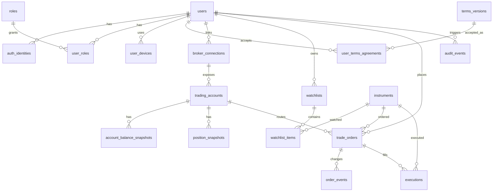

# MetaServer Database Design v1

## 1. 전제

MetaServer는 증권 거래만을 위한 앱이 아니라, 전체 서버에서 구성원에게 여러 서비스를 제공하는 플랫폼이다. 따라서 DB는 `회원/권한/동의`를 중심에 두고, 주식 매매는 하나의 서비스 도메인으로 붙인다.

기본 구성은 다음을 전제로 한다.

```text
Client: Flutter App, Web
Backend: FastAPI
Auth: Firebase Auth
Broker API: 한국투자증권 KIS Developers
Main DB: PostgreSQL
Memory DB: Redis
```

KIS Developers는 REST, WebSocket, OAuth 토큰, 국내주식 주문/계좌, 잔고조회, 주식일별주문체결조회, 실시간체결가/호가/체결통보 API를 제공한다. DB는 이 흐름을 기준으로 주문, 체결, 계좌, 잔고, 감사 로그를 분리한다.

참고:
- https://apiportal.koreainvestment.com/intro
- https://apiportal.koreainvestment.com/apiservice

## 2. 설계 원칙

1. Firebase UID는 외부 인증 식별자이고, 서비스 내부 기준 ID는 `users.id`로 둔다.
2. KIS App Secret, 접근 토큰, 계좌번호 원문 등 민감 정보는 평문 저장하지 않는다.
3. 주문은 삭제하지 않고, 정정/취소/실패까지 상태 이벤트로 남긴다.
4. 실시간 호가/체결 같은 고빈도 데이터는 Redis와 WebSocket으로 처리하고, PostgreSQL에는 필요한 스냅샷과 사용자 행동만 저장한다.
5. 계좌, 잔고, 포지션은 "현재값"보다 "스냅샷" 중심으로 저장해서 과거 화면 재현과 감사가 가능하게 한다.
6. 앱/웹 화면에서 같은 API를 쓰도록 데이터 모델을 공통화한다.

## 3. 도메인 구성



## 4. 화면별 필요한 테이블

### 로그인 화면

| 화면/기능 | 주요 테이블 |
|---|---|
| Firebase 로그인 완료 후 사용자 생성 | `users`, `auth_identities` |
| 약관 동의 | `terms_versions`, `user_terms_agreements` |
| 마지막 로그인 표시 | `login_events` |
| 푸시 토큰 등록 | `user_devices` |

### 회원관리 화면

| 화면/기능 | 주요 테이블 |
|---|---|
| 회원 목록/상태 관리 | `users`, `user_profiles` |
| 관리자/운영자 권한 | `roles`, `user_roles` |
| 계정 정지/탈퇴 | `users`, `audit_events` |
| 사용자 활동 이력 | `login_events`, `audit_events` |

### 주식 매매 화면

| 화면/기능 | 주요 테이블 |
|---|---|
| 계좌 연결 상태 | `broker_connections`, `trading_accounts` |
| 관심종목 | `instruments`, `watchlists`, `watchlist_items` |
| 주문 입력 | `instruments`, `trading_accounts`, `trade_orders` |
| 주문 진행 상태 | `trade_orders`, `order_events` |
| 체결 내역 | `executions` |
| 보유 종목/잔고 | `position_snapshots`, `account_balance_snapshots` |
| 가격 알림 | `price_alerts`, `user_devices` |

## 5. 핵심 테이블

### `users`

MetaServer 내부 회원의 기준 테이블이다.

주요 컬럼:
- `id`: 서비스 내부 UUID
- `user_no`: 관리자 화면과 운영 로그에서 보기 쉬운 순번형 사용자 번호
- `firebase_uid`: Firebase Auth UID
- `login_id`: 이메일/로컬 로그인/관리자 검색용 로그인 ID
- `password_hash`: LOCAL 인증 확장 시 사용할 비밀번호 해시
- `email`
- `status`: `active`, `suspended`, `deleted`
- `user_type`: `member`, `admin`, `operator`, `system` 등 사용자 유형
- `auth_provider`: `firebase`, `local`, `google`, `apple`, `facebook` 등 대표 인증 제공자
- `mfa_enabled`, `locked_at`
- `display_name`
- `user_name`
- `created_by`, `updated_by`, `deleted_by`
- `created_at`, `updated_at`, `deleted_at`

### `auth_identities`

Firebase provider 연결 상태를 저장한다. Google, Apple, Facebook, email/password 등을 같은 구조로 다룬다.

주요 컬럼:
- `provider`: `google.com`, `apple.com`, `facebook.com`, `password`
- `provider_uid`
- `email`
- `email_verified`

### `broker_connections`

사용자가 KIS와 연결한 인증/권한 상태다. KIS 토큰, 계좌 참조, 제휴 플로우 결과 등 민감 정보는 암호화해서 저장한다.

주요 컬럼:
- `broker`: 우선 `kis`
- `environment`: `paper`, `live`
- `status`: `pending`, `active`, `revoked`, `error`
- `encrypted_payload`: 암호화된 KIS 연결 정보
- `token_expires_at`

### `trading_accounts`

사용자가 연결한 실제/모의 거래 계좌를 표현한다.

주요 컬럼:
- `account_no_masked`: 화면 표시용 마스킹 계좌번호
- `account_no_hash`: 중복 체크용 해시
- `account_alias`
- `is_primary`
- `status`

### `instruments`

거래 가능한 종목 마스터다. KIS 종목정보파일 또는 별도 데이터 소스에서 동기화한다.

주요 컬럼:
- `market`: `KRX`, `NXT`, `NASDAQ`, `NYSE` 등
- `symbol`
- `name_ko`, `name_en`
- `instrument_type`: `stock`, `etf`, `etn`, `reit` 등
- `currency`
- `is_tradable`

### `trade_orders`

사용자가 앱/웹에서 낸 주문의 기준 테이블이다. KIS 원장 주문번호와 내부 주문번호를 모두 저장한다.

주요 컬럼:
- `client_order_id`: 클라이언트 idempotency key
- `kis_order_no`: KIS 주문번호
- `side`: `buy`, `sell`
- `order_kind`: `market`, `limit`, `after_hours`, `reservation` 등
- `quantity`, `limit_price`
- `status`: 내부 주문 상태
- `broker_status_code`: KIS 응답 상태 코드
- `request_payload`, `response_payload`: 원문 보관용 JSONB

### `order_events`

주문 상태 변경 이력이다. 접수, 전송, 수락, 부분체결, 정정요청, 취소, 거절 등을 전부 남긴다.

### `executions`

체결 내역이다. 한 주문이 여러 번 부분체결될 수 있으므로 `trade_orders`와 1:N이다.

### `account_balance_snapshots`, `position_snapshots`

잔고/보유종목은 API 호출 시점마다 스냅샷으로 저장한다. 화면은 최신 스냅샷을 보여주고, 과거 잔고 조회도 가능하게 한다.

## 6. Redis 사용 위치

PostgreSQL에 모든 실시간 데이터를 밀어 넣으면 비용과 락 부담이 커진다. Redis는 다음에 쓴다.

```text
auth:login-rate:{ip_or_uid}
auth:oauth-state:{state}
kis:access-token:{environment}
kis:websocket-key:{environment}
market:quote:{market}:{symbol}
market:orderbook:{market}:{symbol}
user:ws-subscriptions:{user_id}
order:idempotency:{user_id}:{client_order_id}
order:lock:{order_id}
```

Redis 데이터는 TTL을 반드시 둔다. 영구 보존이 필요한 주문, 체결, 감사 로그는 PostgreSQL이 기준이다.

## 7. 보안/감사 설계

민감 정보:
- KIS App Secret
- KIS access token / refresh token
- 계좌번호 원문
- 주민등록번호, 인증정보, 계좌 비밀번호

저장 원칙:
- DB에는 원칙적으로 계좌 비밀번호를 저장하지 않는다.
- 토큰과 계좌 참조는 KMS 또는 서버 키로 envelope encryption 후 저장한다.
- 화면 표시에는 마스킹 값만 사용한다.
- 중복 확인에는 해시 값을 사용한다.
- 주문 요청/응답 원문은 JSONB로 보관하되 민감 필드는 마스킹한다.

감사 로그:
- 로그인 성공/실패
- 계좌 연결/해제
- 주문 생성/정정/취소
- 관리자 상태 변경
- 약관 동의
- 민감 데이터 접근

## 8. 첫 구현 범위

MVP에서는 다음 테이블부터 만들면 된다.

```text
1. users
2. auth_identities
3. user_profiles
4. roles
5. user_roles
6. terms_versions
7. user_terms_agreements
8. login_events
9. broker_connections
10. trading_accounts
11. instruments
12. watchlists
13. watchlist_items
14. trade_orders
15. order_events
16. executions
17. account_balance_snapshots
18. position_snapshots
19. price_alerts
20. audit_events
```

이후 다음을 확장한다.

```text
- 관리자 감사 상세
- 결제/구독
- 커뮤니티/구성원 서비스
- 리서치/뉴스
- 전략/조건검색
- 모의투자 리그
- 알림 템플릿
```

## 9. 구현 메모

- FastAPI에서는 SQLAlchemy 2.x + Alembic 조합을 권장한다.
- 운영 DB에서는 애플리케이션 객체를 `metaserver` 스키마에 둔다.
- 2026-05-03 기준 `dbrobert` PostgreSQL 11 DB에 `metaserver` 스키마로 1차 스키마를 적용했다.
- UUID 기본값은 확장 없이 동작하는 `ms_generate_uuid()` 함수를 사용한다. 애플리케이션에서는 UUID v4를 생성해서 넘겨도 된다.
- 이메일은 `text`로 저장하고 `lower(email)` 부분 인덱스로 대소문자 중복 문제를 줄인다.
- 돈/수량은 float 금지, `numeric` 사용.
- 주문 생성 API는 `client_order_id`를 필수로 받아 중복 주문을 방지한다.
- 주문 상태는 단일 컬럼만 믿지 말고 `order_events`를 기준 이력으로 삼는다.
- `request_payload`, `response_payload`에는 KIS 원문을 보관하되 민감 필드는 제거하거나 마스킹한다.
